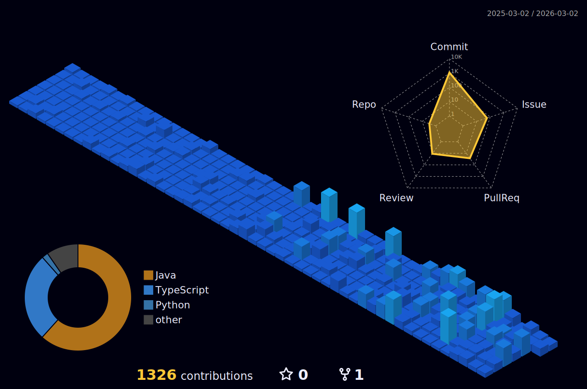

<!-- ==================== 헤더 ==================== -->

  

<!-- ==================== 기술 스택 ==================== -->

  
  
  
  
  
  
  
  
   
  
  
  
  
  
  
  
  
   
  
  
  
  
  
  
  
  
  
  
  

 
<!-- ==================== 좌우 배치 ==================== -->
<table>
  <tr>
    <td valign="top" width="50%">
      <h3>💼 Experience</h3>
      <ul>
        <li><code>2025.01 ~ 진행 중</code> SSAFY 15기</li>
        <li><code>2025.09 ~ 2025.12</code> ICT 인턴십</li>
        <li><code>2025.03 ~ 2025.06</code> ICT 인턴십</li>
        <li><code>2020.03 ~ 2026.02</code> 세종대학교 컴퓨터공학과</li>
      </ul>
      <h3>🏆 Awards</h3>
      <ul>
        <li><code>2025.02</code> 지역대학간 SW캡스톤디자인 경진대회 <b>최우수상</b></li>
        <li><code>2024.12</code> WE-Meet Project <b>교육부장관상</b></li>
        <li><code>2024.12</code> IN-JEJU Challenge <b>총장상</b></li>
        <li><code>2024.12</code> 세종대학교 창의설계경진대회 <b>대상</b></li>
      </ul>
      <h3>📜 Certificates</h3>
      <ul>
        <li><code>2025.09</code> 정보처리기사</li>
        <li><code>2025.07</code> OPIc IM1</li>
        <li><code>2024.12</code> 소프트웨어등록증 & 저작권</li>
      </ul>
       
      

        
      

    </td>
    <td valign="top" width="50%">
      

        
        
        
        
      

    </td>
  </tr>
  <tr>
    <td colspan="2">
      

        <picture>
          <source media="(prefers-color-scheme: dark)" srcset="https://raw.githubusercontent.com/rtaeho/rtaeho/output/github-snake-dark.svg" />
          <source media="(prefers-color-scheme: light)" srcset="https://raw.githubusercontent.com/rtaeho/rtaeho/output/github-snake.svg" />
          
        </picture>
      

    </td>
  </tr>
</table>
